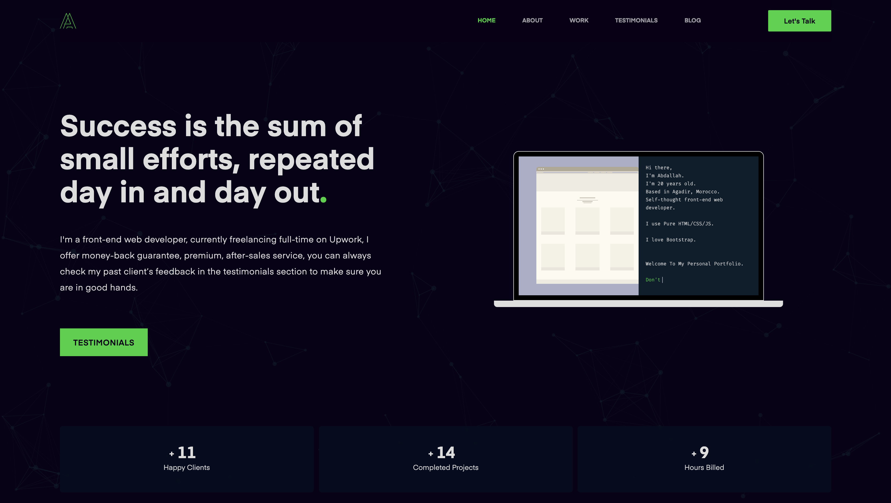

<p align="center">
  <a href="https://abisabdallah.com">
    
  </a>
</p>
<h1 align="center">
Abdallah Abis</h1>

<br />
<br />



<br />

<p>This Portfolio was designed and developed by <a href='https://twitter.com/Dev_abis' target="_blank">Abdallah Abis</a> using <a href='https://nextjs.org/' target="_blank">Next.js</a> and hosted on <a href='https://vercel.com//' target="_blank">Vercel</a>.<strong> I hope you like it.</strong></p>

<br />
<br />

🔐

## 💥 FORK IT, BUT PLEASE MENTION ME:exclamation:

🔐

<br />
<br />

## 🛠 Installation & Set Up

1.  Check the folder structure on start-here.md

2.  Fork and/or clone this repo.

    ```sh
    git clone "github repo"
    ```

3.  Install dependencies

    ```sh
    yarn
    ```

4.  Start the development server

         ```sh
         yarn dev
         ```

5.  Open [http://localhost:3000](http://localhost:3000) with your browser to see the result.

## 🚀 Building and Running for Production

Generate a full static production build

```sh
yarn build
```

## Learn More

To learn more about Next.js, take a look at the following resources:

- [Next.js Documentation](https://nextjs.org/docs) - learn about Next.js features and API.
- [Learn Next.js](https://nextjs.org/learn) - an interactive Next.js tutorial.

You can check out [the Next.js GitHub repository](https://github.com/vercel/next.js/) - your feedback and contributions are welcome!

## Deploy on Vercel

The easiest way to deploy your Next.js app is to use the [Vercel Platform](https://vercel.com/import?utm_medium=default-template&filter=next.js&utm_source=create-next-app&utm_campaign=create-next-app-readme) from the creators of Next.js.

Check out our [Next.js deployment documentation](https://nextjs.org/docs/deployment) for more details.
