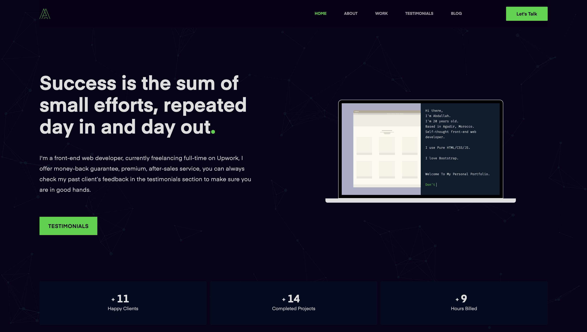

<p align="center">
  <a href="https://abisabdallah.com" target="_blank">
    
  </a>
</p>

<h1 align="center">Abdallah Abis</h1>

<p align="center">
  <em>Personal Portfolio Website</em>
</p>

<br />

<p align="center">
  
</p>

<br />

> This portfolio was thoughtfully designed and developed by [**Abdallah Abis**](https://twitter.com/Dev_abis) using [**Next.js**](https://nextjs.org/), and is proudly hosted on [**Vercel**](https://vercel.com/).  
> ✨ Feel free to explore, fork, or contribute!

---

## 🔁 Forking & Attribution

You're welcome to fork this portfolio for your own use—but please be kind and **mention me** somewhere in your version. A little credit goes a long way 💜

---

## 🚀 Getting Started

To get this project up and running locally:

### 1. 📁 Explore the Folder Structure

Start with `start-here.md` to understand the project layout and configuration.

### 2. 🧬 Clone the Repository

```bash
git clone https://github.com/AbdallahAbis/AbdallahAbis-v2.git
cd AbdallahAbis-v2
```

### 3. 📦 Install Dependencies

```bash
yarn
```

### 4. 🧪 Run the Development Server

```bash
yarn dev
```

Visit [http://localhost:3000](http://localhost:3000) in your browser to preview the site.

---

## 🏗 Build for Production

To create an optimized production build:

```bash
yarn build
```

You can then serve it with any static hosting platform or deploy directly via Vercel.

---

## 📚 Learn More

To dive deeper into the technologies used:

- [Next.js Docs](https://nextjs.org/docs)
- [Next.js Tutorial](https://nextjs.org/learn)
- [Next.js GitHub Repo](https://github.com/vercel/next.js)

---

## ☁️ Deploy to Vercel

Deploy the site in seconds using Vercel:

➡️ [**Deploy Now on Vercel**](https://vercel.com/import?utm_medium=default-template&filter=next.js&utm_source=create-next-app&utm_campaign=create-next-app-readme)

Or check the [official deployment guide](https://nextjs.org/docs/deployment) for more options.

---
